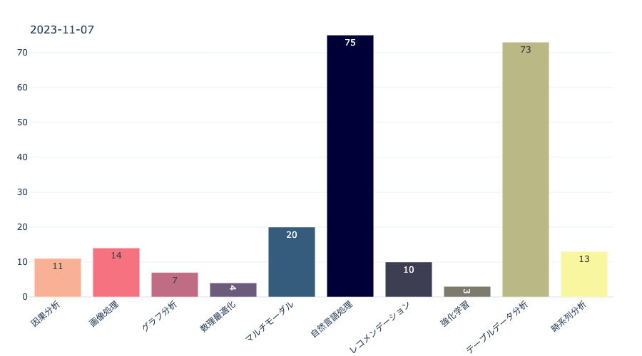

# Data Science Wiki

[Data Science Wiki](https://www.data-science-wiki.net/)で公開されているコードが保存されているリポジトリです．

* Data Science Wikiとは\
Data Science WikiとはデータサイエンスやAI関連の技術をより身近に使えるようにするためのまとめサイトになります．最先端の研究成果や技術，OSSを紹介することでより広く社会で使ってもらい，ビジネスと研究を近づけるきっかけ作りを目指しています．

* [Data Science wiki GPTs](https://chat.openai.com/g/g-w0APV35yz-data-science-wiki-gpts)\
Data Science Wikiの掲載してある技術をもとに回答してくれるChatGPT

* [Data Science wikiへのページの追加方法](https://github.com/fuyu-quant/data-science-wiki/wiki/Data-Science-wiki%E3%81%B8%E3%81%AE%E3%83%9A%E3%83%BC%E3%82%B8%E3%81%AE%E8%BF%BD%E5%8A%A0%E6%96%B9%E6%B3%95)

* Data Science wikiへのページの追加依頼\
Data Science wikiに追加して欲しい項目やOSSがある場合は[ここのページ](https://github.com/fuyu-quant/data-science-wiki/issues)の「New issue」を押し追加して欲しい内容を記載してください．コメント欄には追加したいOSSに関するリンクや説明などを記載していただけるととても助かります．

* 現在アップロードされているファイルの数

* Sponsorsについて\
Data Science Wikiでは現在スポンサーを募集しています．AWSのコスト費や活動費として使いたいと考えています．プロジェクトに興味がある方はぜひご検討のほどよろしくお願いします．
